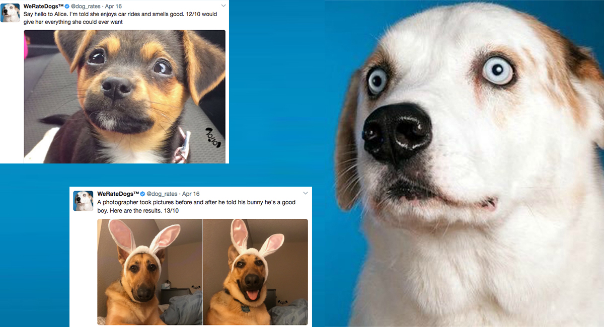

# WeRateDogs-Twitter

### Introduction:
The dataset that you will be wrangling (and analyzing and visualizing) is the tweet archive of Twitter user @dog_rates, also known as WeRateDogs. WeRateDogs is a Twitter account that rates people's dogs with a humorous comment about the dog. These ratings almost always have a denominator of 10. The numerators, though? Almost always greater than 10. 11/10, 12/10, 13/10, etc. Why? Because "they're good dogs Brent." WeRateDogs has over 4 million followers and has received international media coverage.

### Project Steps Overview
<li> Step 1: Gathering data
<li> Step 2: Assessing data
<li> Step 3: Cleaning data
<li> Step 4: Storing data
<li> Step 5: Analyzing, and visualizing data
<li> Step 6: Reporting
 

